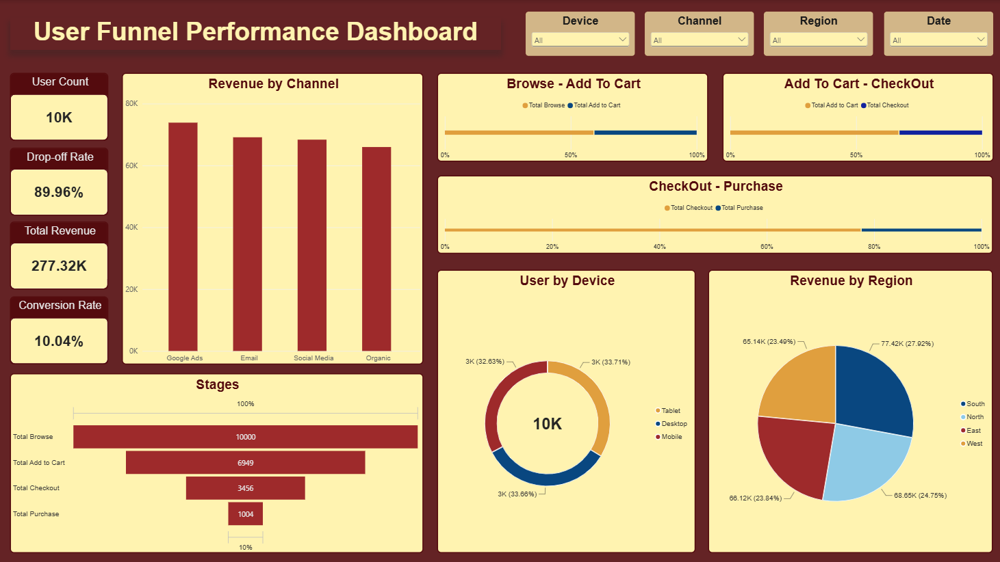

# E-commerce Conversion Funnel Analysis

A conversion funnel analysis project tracking the full user journey from browsing to purchase, identifying drop-off points, and recommending ways to improve conversion — visualized across three interactive Power BI dashboards.

## Overview

This project defines the e-commerce conversion funnel, analyzes user drop-off at each stage, calculates conversion rates between stages, identifies bottlenecks, and breaks performance down by channel, region, device, and product category — all backed by SQL analysis and a detailed insights report.

- **Total Sessions:** 10,000
- **Overall Conversion Rate:** 10.04%
- **Total Revenue:** $277,323.06
- **Average Order Value:** $276.22

## Project Structure

```
├── data/
│   ├── Funnel_Analysis_Data.csv              # Raw dataset
│   └── Funnel_Analysis_Preprocessed.csv      # Cleaned and preprocessed dataset
├── docs/
│   ├── FunnelStages_&_SessionSummary.md      # Funnel stage definitions and session summary view
│   └── funnel_analysis.md                    # Full analysis report
├── assets/
│   ├── User_Funnel_Performance_Dashboard.png      # Main funnel and channel/region dashboard
│   ├── Funnel_DropOff_Diagnostics.png             # Drop-off rate and revenue trend dashboard
│   ├── Customer_&_Behaviour_Insights.png          # Bounce rate and behavior dashboard
│   └── Complete_Funnel_Analysis_Visualisation.pbix   # Power BI dashboard file
├── data_preprocessing_&_cleaning.sql         # SQL queries for cleaning and preprocessing
├── funnel_analysis.sql                       # SQL queries for analysis
└── README.md
```

## Funnel Stages

The conversion funnel tracks four sequential stages: **Browse → Add to Cart → Checkout → Purchase**. Full stage definitions and the SQL view used to summarize each session are documented in [docs/FunnelStages_&_SessionSummary.md](docs/FunnelStages_&_SessionSummary.md).

## Analysis Report

The full breakdown — overall funnel performance, revenue metrics, and performance by channel, region, device, and product category — is in [docs/funnel_analysis.md](docs/funnel_analysis.md). The SQL behind every metric is in [funnel_analysis.sql](funnel_analysis.sql), with preprocessing and cleaning steps in [data_preprocessing_&_cleaning.sql](data_preprocessing_&_cleaning.sql).

**Key findings:**
- The steepest drop-off happens at Checkout → Purchase, where 70.95% of users abandon before completing their order
- Google Ads drives the highest revenue ($73.9K) and conversion rate (10.63%) among all channels
- The South region leads in conversion rate, revenue, and average order value
- Desktop converts better than Mobile (10.58% vs. 9.47%), pointing to mobile checkout friction
- Electronics is the top-performing product category by both conversion rate and revenue per session

## Recommendations

Five targeted recommendations — covering checkout optimization, regional investment, retargeting, mobile experience, and cross-selling — are detailed at the end of [docs/funnel_analysis.md](docs/funnel_analysis.md).

## Dashboards

Three Power BI dashboards visualize different layers of the funnel — overall funnel performance, drop-off diagnostics, and customer behavior.



**User Funnel Performance Dashboard** — overall funnel stages, revenue by channel, and revenue by region, filterable by Device, Channel, Region, and Date.

The other two dashboard views (Funnel Drop-Off Diagnostics and Customer & Behaviour Insights) are included as screenshots in the `assets/` folder, alongside the full interactive `.pbix` file (`assets/Complete_Funnel_Analysis_Visualisation.pbix`, requires Power BI Desktop to open). A screen recording walkthrough of all three is also included in the same folder.


## Tools Used

- **SQL** — data preprocessing and analysis
- **Power BI** — visualization